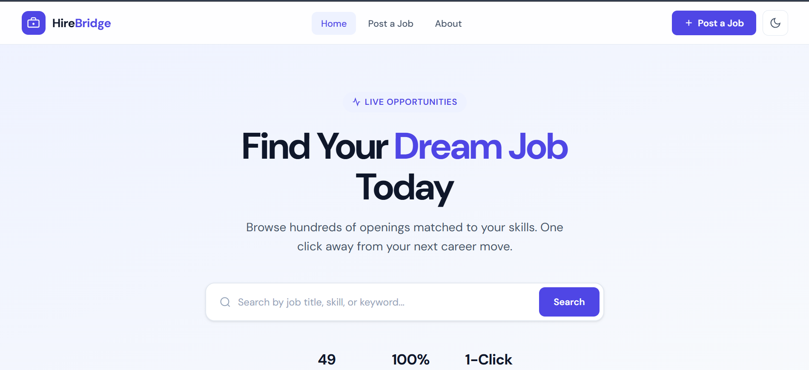
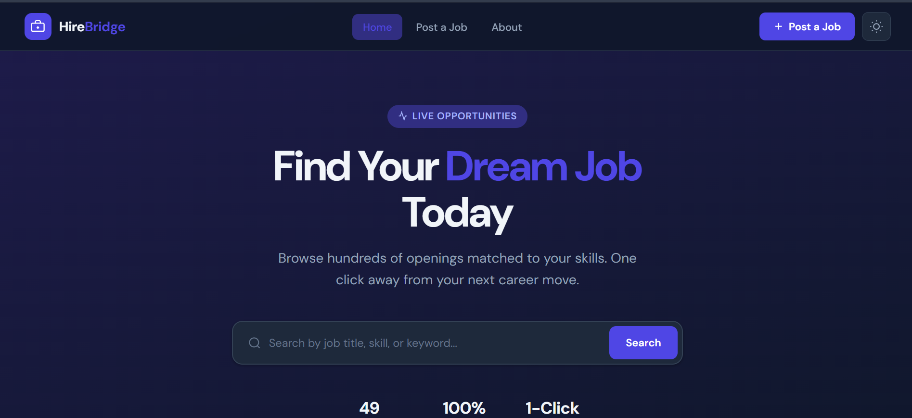
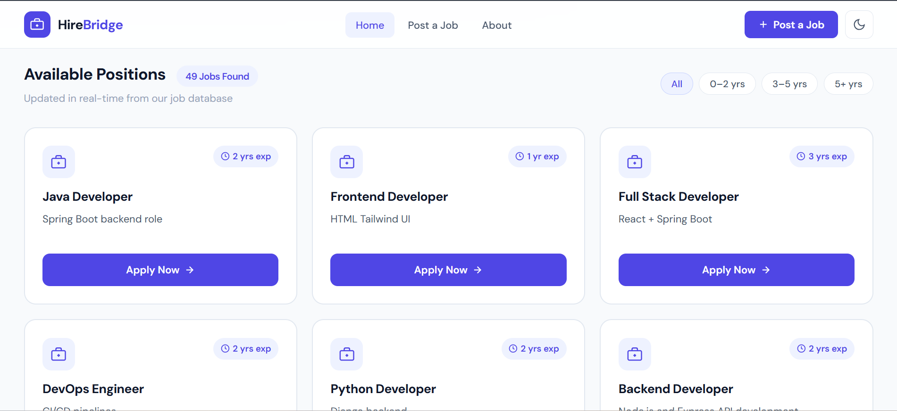
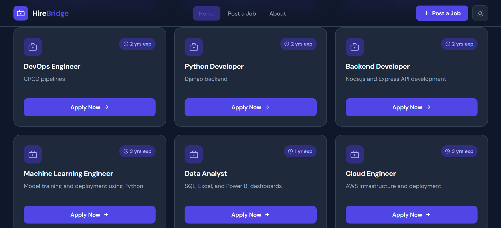
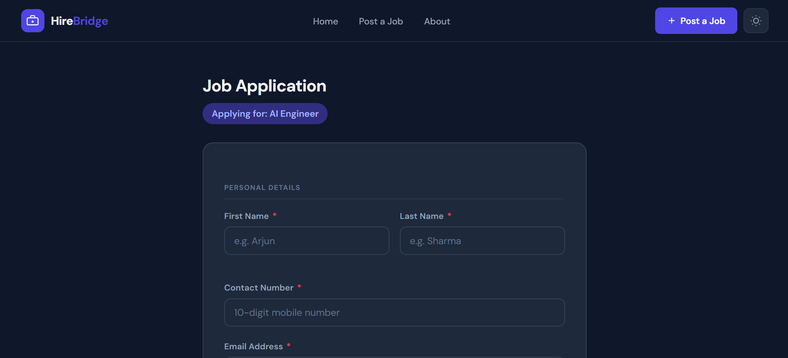
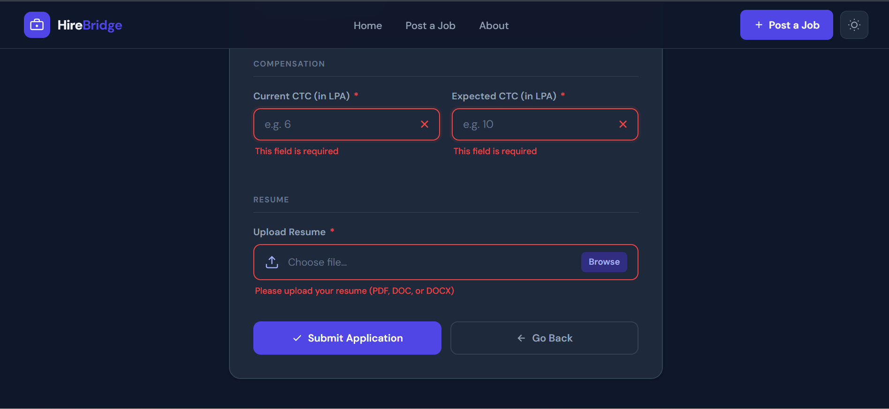
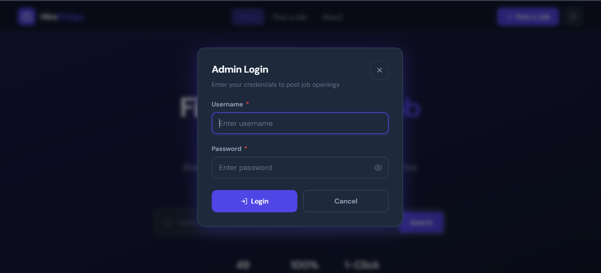
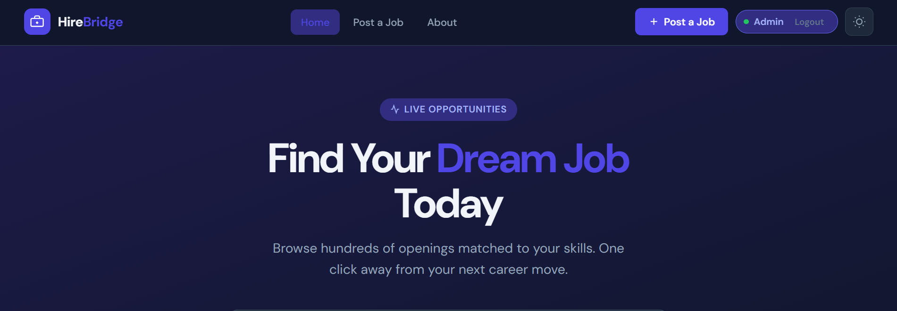
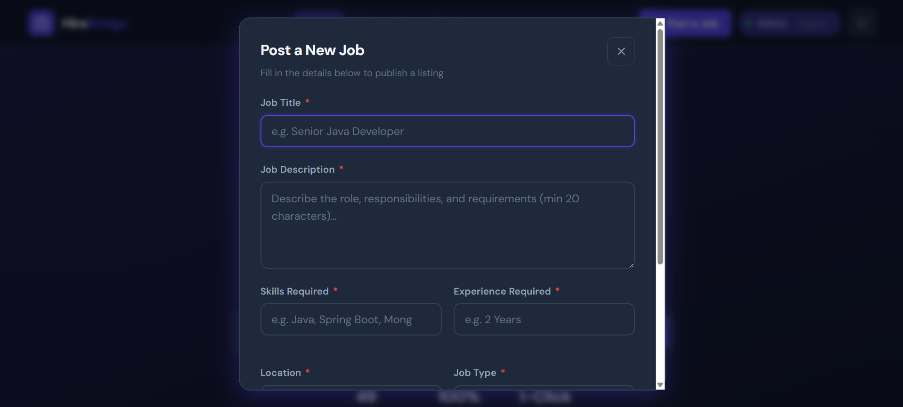

# HireBridge - Job Portal

A full-stack job listing and application portal built with **Spring**, **MongoDB**, and a hand-crafted **Vanilla JS + Tailwind CSS** frontend. Browse live job postings, search by skill or keyword, filter by experience, and submit applications - all from a clean, responsive UI with dark mode support.

---

## Table of Contents

- [Features](#features)
- [Tech Stack](#tech-stack)
- [Project Structure](#project-structure)
- [Getting Started](#getting-started)
- [API Endpoints](#api-endpoints)
- [Frontend Pages](#frontend-pages)
- [Future Improvements](#future-improvements)

---

## Features

### Job Listings Page (`index.html`)
- **Real-time search** - queries the backend `/posts/{text}` endpoint as you type (280ms debounce), with a client-side fallback filter
- **Experience filter chips** - instantly filter cards by 0–2 yrs, 3–5 yrs, or 5+ yrs
- **Responsive 3-column card grid** - collapses to 2 columns on tablet, 1 column on mobile
- **Shimmer skeleton loaders** - shown while the API fetches, replaced by real cards on load
- **Empty state & error state** - friendly inline messages with a retry button on failure
- **Live job count badge** - updates dynamically as search/filter results change

### Application Form Page (`apply.html`)
- **Pre-filled job title** - reads the `?title=` query parameter and displays the role prominently
- **9 form fields** across four sections: Personal Details, Education, Compensation, Resume
- **Inline validation** - validates on both blur and submit; shows green checkmark or red ✕ icon per field
- **Custom file upload** - replaces the default browser input with a styled drag-friendly zone; accepts `.pdf`, `.doc`, `.docx` only
- **Success flow** - on valid submit, shows a success banner and redirects to the listings page after 1.5s

### Global
- **Dark / Light mode toggle** - persists via `localStorage` across page navigation
- **Fixed glassmorphic navbar** - backdrop blur, logo, nav links, and hamburger menu on mobile
- **Fully accessible** - semantic HTML, `aria-label` on icon buttons, `aria-live` on dynamic regions, keyboard-navigable cards

---

## Tech Stack

### Backend
| Layer | Technology |
|---|---|
| Framework | Spring framework |
| Language | Java 11 |
| Database | MongoDB |
| ODM | Spring Data MongoDB |
| Build Tool | Maven |

### Frontend
| Layer | Technology |
|---|---|
| Markup | HTML5 (semantic) |
| Styling | CSS3 with custom design tokens + Tailwind CSS |
| Scripting | Vanilla JavaScript (ES2020, no frameworks) |
| Fonts | DM Sans + DM Mono via Google Fonts |
| API Calls | `fetch()` against the same Spring origin |

---

## 📸 Screenshots

| Page | Preview |
|---|---|
| 🏠 Home Page |  |
| 🏠 Home Page (Dark Mode) |  |
| 🔍 Job Listings  |  |
| 🔍 Job Listings  |  |
| Application Form |  |
| Application Form |  |
| 🔐 Admin Login |  |
| 🔐 Admin Logged in |  |
| ➕ Post Job Modal |  |
| Mobile View | <div align="center">   </div> |


## Project Structure

```
hirebridge/
├── src/
│   └── main/
│       ├── java/com/hirebridge/joblisting/
│       │   ├── JoblistingApplication.java       # Entry point
│       │   ├── controller/
│       │   │   ├── PostController.java          # REST API endpoints
│       │   │   └── PageController.java          # Thymeleaf page routing
│       │   ├── model/
│       │   │   └── Post.java                    # Job post document model
│       │   └── repository/
│       │       ├── PostRepository.java          # MongoDB CRUD repository
│       │       ├── SearchRepository.java        # Search interface
│       │       └── SearchRepositoryImpl.java    # Atlas Search + regex fallback
│       └── resources/
│           ├── templates/
│           │   ├── index.html                   # Job listings page
│           │   └── apply.html                   # Application form page
│           ├── static/
│           │   ├── css/
│           │   │   ├── style.css                # Full design system + component styles
│           │   │   ├── input.css                # Tailwind source
│           │   │   └── output.css               # Tailwind compiled output
│           │   ├── script.js                    # index.html logic
│           │   └── apply.js                     # apply.html logic
│           └── application.properties
├── pom.xml
├── tailwind.config.js
└── package.json
```

---

## Getting Started

### Prerequisites

- Java 11 or higher
- Maven 3.6+
- MongoDB running locally on port `27017`
- Node.js (only if you want to recompile Tailwind CSS)

### 1. Clone the repository

```bash
git clone https://github.com/your-username/hirebridge.git
cd hirebridge
```

### 2. Configure MongoDB

The app connects to a local MongoDB instance by default. No changes needed if MongoDB is running locally. To use a different host, URI, or MongoDB Atlas, update `src/main/resources/application.properties`:

```properties
spring.data.mongodb.host=localhost
spring.data.mongodb.port=27017
spring.data.mongodb.database=hirebridge
```

For MongoDB Atlas, replace the above with:

```properties
spring.data.mongodb.uri=mongodb+srv://<username>:<password>@cluster.mongodb.net/hirebridge
```

### 3. Seed the database (optional)

A sample JSON payload is included in the `jsondata` file. You can insert it using the REST API or MongoDB Compass:

```bash
# Using the POST endpoint
curl -X POST http://localhost:8080/post \
  -H "Content-Type: application/json" \
  -d '{"profile":"Java Developer","desc":"Build scalable backend services","exp":3,"techs":["Java","Spring Boot","MongoDB"]}'
```

### 4. Run the application

```bash
./mvnw spring-boot:run
```

The app starts on **http://localhost:8080**

### 5. (Optional) Recompile Tailwind CSS

```bash
npm install
npx tailwindcss -i ./src/main/resources/static/css/input.css \
                -o ./src/main/resources/static/css/output.css \
                --watch
```

---

## API Endpoints

All endpoints are served by `PostController.java`.

| Method | Endpoint | Description |
|---|---|---|
| `GET` | `/allPosts` | Returns all job posts as a JSON array |
| `GET` | `/posts/{text}` | Full-text search across `profile`, `desc`, and `techs` fields |
| `POST` | `/post` | Creates a new job post (accepts JSON body) |

### Job Post Schema

```json
{
  "profile": "Java Developer",
  "desc": "Build scalable REST APIs using Spring Boot and MongoDB.",
  "exp": 3,
  "techs": ["Java", "Spring Boot", "MongoDB", "REST APIs"]
}
```

| Field | Type | Description |
|---|---|---|
| `profile` | `String` | Job title / role name |
| `desc` | `String` | Short job description |
| `exp` | `int` | Years of experience required |
| `techs` | `String[]` | Array of required technologies/skills |

### Search Implementation

The search endpoint (`/posts/{text}`) uses a two-tier strategy in `SearchRepositoryImpl`:

1. **MongoDB Atlas Search** (primary) - uses the `$search` aggregation stage for full-text relevance search across `techs`, `desc`, and `profile`, sorted by experience ascending, limited to 5 results.
2. **Regex fallback** (automatic) - if Atlas Search is unavailable (e.g., local MongoDB without a search index), it falls back to a case-insensitive regex query using `$or` across the same fields.

---

## Frontend Pages

### `index.html` - Job Listings

Served by Thymeleaf at `GET /`. On load, `script.js` fetches all jobs from `/allPosts` and renders them as cards. Search uses the `/posts/{text}` endpoint with a 280ms debounce; if that fails, it filters the already-fetched data client-side.

Clicking **Apply Now** on any card navigates to:
```
/apply.html?title=Java+Developer
```

### `apply.html` - Application Form

A static page served from `static/`. Reads the `title` query parameter on load and injects it into the page heading. Validated fields:

| Field | Rule |
|---|---|
| First / Last Name | Letters only (`/^[A-Za-z]+$/`) |
| Contact Number | Exactly 10 digits (`/^\d{10}$/`) |
| Email | Standard email format |
| Education | Must select a non-default option |
| Major | Letters and spaces only |
| Current / Expected CTC | Valid non-negative number |
| Resume | `.pdf`, `.doc`, or `.docx` only |

---

## Future Improvements

- [ ] Persist applications to MongoDB with a dedicated `Application` document model
- [ ] Pagination or infinite scroll on the listings page for large datasets
- [ ] Resume file upload to cloud storage (AWS S3 / Cloudinary)
- [ ] Email confirmation on application submit (Spring Mail)
- [ ] Swagger UI re-enabled at `/swagger-ui.html` for API exploration

---

## License

This project is open source and available under the [MIT License](LICENSE).
